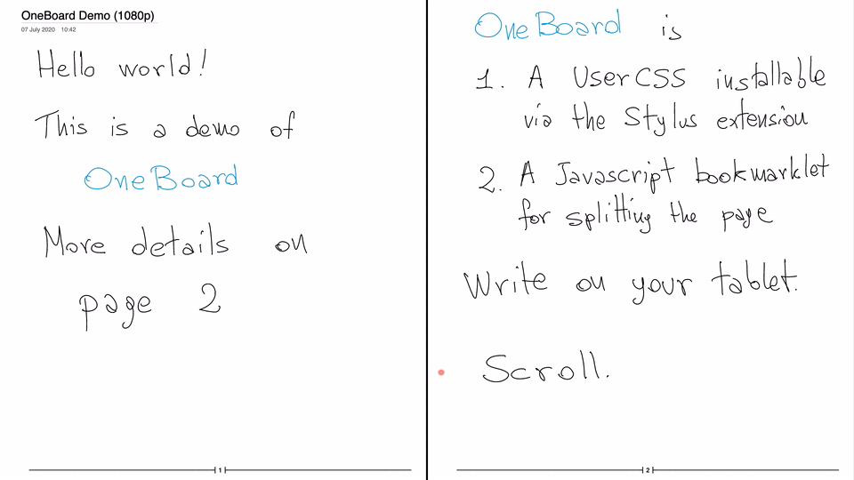
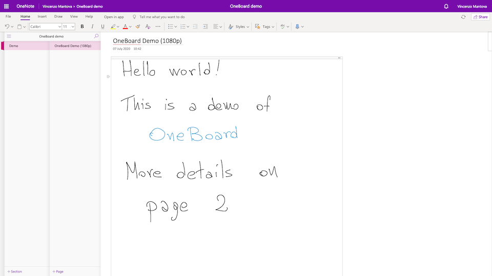
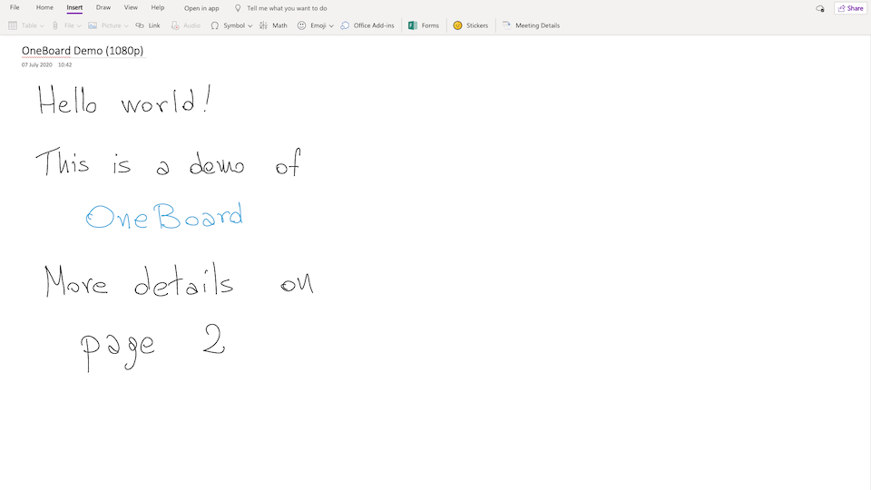
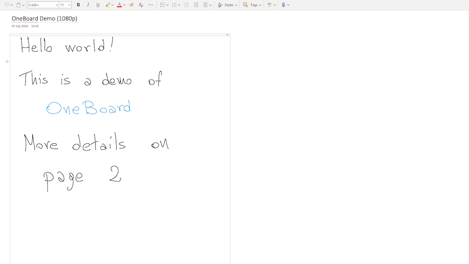
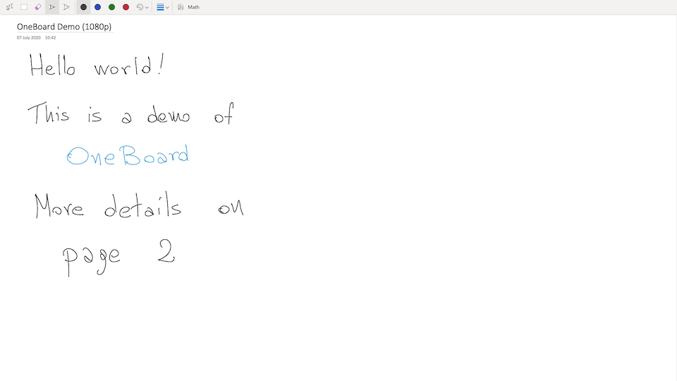
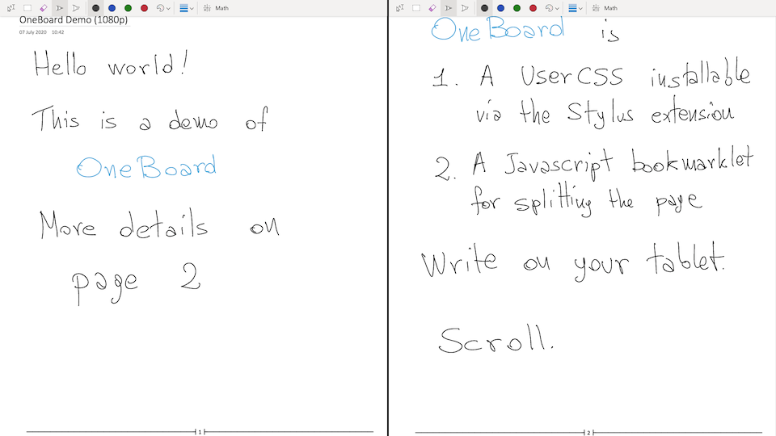

# OneBoard

> Full screen whiteboard with OneNote Online

[](https://github.com/xworld21/OneBoard/releases/) [](https://GitHub.com/xworld21/OneBoard) [](https://GitHub.com/xworld21/OneBoard/watchers/)

This is a minimal CSS hack that transforms OneNote Online into a full screen whiteboard with laser pointer. With the "Split Vertically" bookmarklet below, you may also present OneNote as *two* sliding whiteboards.

The intended use case is to run OneBoard in "Presentation mode", while you write and annotate your page on another window or another device. See below for additional modes that let you work directly on the page but still maximise the content.

**BEWARE:** this is a hack that relies on ids and classes in the HTML delivered by Microsoft. Parts may break at any moment, although hopefully not very often.

<figure>
  
  <figcaption>Presentation mode, split vertically</figcaption>
</figure>

---

<figure>
  
  <figcaption>Normal OneNote, with OneBoard disabled</figcaption>
</figure>

### Bugs and limitations

- OneNote notebooks live inside an iframe with origin `*onenote.officeapps.live.com`. The current version of this UserCSS applies to iframes from the domains `onenote.officeapps.live.com` and `${region}-onenote.officeapps.live.com` for `${region}` in `euc,ukc,usc`.
- The settings might change shape in the future. If you are not using the defaults, you should disable automatic updates for OneBoard in Stylus.

To report bugs or changes in behavior, request more servers, or suggest new functionality please file an [issue](https://github.com/xworld21/OneBoard/issues) or send a [pull request](https://github.com/xworld21/OneBoard/pulls).

## Installation

Install the [Stylus](https://github.com/openstyles/stylus) extension for your browser (Chrome, the new Edge, Firefox, or Opera), then open the [stylesheet](https://xworld21.github.io/OneBoard/OneBoard.user.css) and click on "Install". After installation, your OneNote pages will appear in presentation mode with no navigation panel and no scrollbars.

To have two side-by-side sliding whiteboards, drag the following link to your bookmark bar (the link is disabled when visiting the github repo – visit the <a href="https://xworld21.github.io/OneBoard">OneBoard</a> page to see the link)

<p align="center">
  <a style="display: block; text-align: center;" href="javascript:void%20function(){javascript:(function(){var%20b=document,c=b.title;b.head.innerHTML=b.body.innerHTML=%22%22,b.title=c;var%20e=b.createElement(%22meta%22);e.name=%22viewport%22,e.content=%22width=device-width,%20height=device-height,%20initial-scale=1%22,b.head.appendChild(e);var%20f=b.querySelector(%22html%22).style,d=b.body,a=d.style;f.width=f.height=a.width=a.height=%22100%25%22,a.margin=a.padding=%220%22;var%20g=b.createElement(%22iframe%22);a.display=%22flex%22;var%20h=g.style;g.src=window.location,h.flex=%220%200%2050%25%22,h.border=%22none%22,h.boxSizing=%22border-box%22;var%20i=g.cloneNode();h.borderRight=%22solid%202px%20black%22,i.style.borderLeft=%22solid%202px%20black%22,d.appendChild(g),d.appendChild(i)})()}();" title="Split Vertically">Split Vertically</a>
</p>

or create manually a bookmark called "Split Vertically" with the following URL:

```javascript
javascript:(function(){var e=document,i=e.title;e.head.innerHTML=e.body.innerHTML="",e.title=i;var t=e.createElement("meta");t.name="viewport",t.content="width=device-width, height=device-height, initial-scale=1",e.head.appendChild(t);var d=e.querySelector("html").style,a=e.body,l=a.style;d.width=d.height=l.width=l.height="100%",l.margin=l.padding="0";var n=e.createElement("iframe");l.display="flex";var r=n.style;n.src=window.location,r.flex="0 0 50%",r.border="none",r.boxSizing="border-box";var o=n.cloneNode();r.borderRight="solid 2px black",o.style.borderLeft="solid 2px black",a.appendChild(n),a.appendChild(o)})();
```

Clicking on the bookmark will split the page you are browsing into two vertical copies. You can inspect the source code of the above minified Javascript in [SplitVertically.js](https://github.com/xworld21/OneBoard/SplitVertically.js).

## Usage

After installation, your OneNote pages will appear in Presentation mode. If you want two whiteboards side-by-side, click on the "Split Vertically" bookmark after the notebook is open on the desired page.

To change mode, click on the Stylus button in your browser toolbar, open the OneBoard settings via the gear icon right of "iframe: OneBoard" and select a different mode.

<figure>
  
  <figcaption>Normal mode</figcaption>
</figure>

---

<figure>
  
  <figcaption>Type mode</figcaption>
</figure>

---

<figure>
  
  <figcaption>Draw mode</figcaption>
</figure>

---

<figure>
  
  <figcaption>Draw mode, split vertically</figcaption>
</figure>

## Settings

There are four modes that hide different parts of the UI. Presentation mode (the default) changes the cursor into a laser pointer. Presentation and Draw modes hide as many text editing indicators as possible, including the insertion caret, text selections, spelling errors, and note container borders.

|                | Presentation | Draw   | Type   | Normal |
| -------------- | ------------ | ------ | ------ | ------ |
| OneNote header | Hidden       | Hidden | Hidden | Hidden |
| Menu bar       | Hidden       | Hidden | Hidden |        |
| Text editing   | Hidden       | Hidden |        |        |
| Ribbon         | Hidden       |        |        |        |
| Laser pointer  | Yes          | No     | No     | No     |

Before activating Draw or Type mode, you should select the appropriate ribbon by switching to Normal mode first.

There are further options to control other elements of the UI.
<dl>
  <dt>Hide navigation panel (default: yes)</dt>
  <dd>Permanently hide the left navigation panel. The panel can also be hidden manually via the "View" ribbon, but it reappears on window resize.</dd>
  <dt>Hide scrollbars (default: yes)</dt>
  <dd>Hide the scrollbars.</dd>
  <dt>Laser pointer size (default: 16px)</dt>
  <dd>Configure the laser pointer size. You may have to disable and reenable OneBoard for the option to take effect.</dd>
  <dt>Prevent horizontal scrolling (default: no)</dt>
  <dd>Prevent horizontal scrolling.<br>
    <strong>Warning.</strong> OneNote will scroll on its own when writing text near a border. This can easily happen by accident when clicking close to the border of the page, as it may create a note container that spans beyond the viewport. You may have trouble scrolling back when this option is enabled.</dd>
</dl>

## License

Distributed under the [GPL3 license](https://github.com/xworld21/OneBoard/LICENSE). Copyright © 2020 Vincenzo Mantova <xworld21@users.sf.net>.